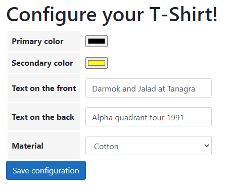

# AspNetCoreDynamicFormDemo
ASP.NET Core MVC 3.1 application demonstrating a form with dynamic fields.

A single form can show a dynamic amount of fields of different types, each with its partial view editor.

